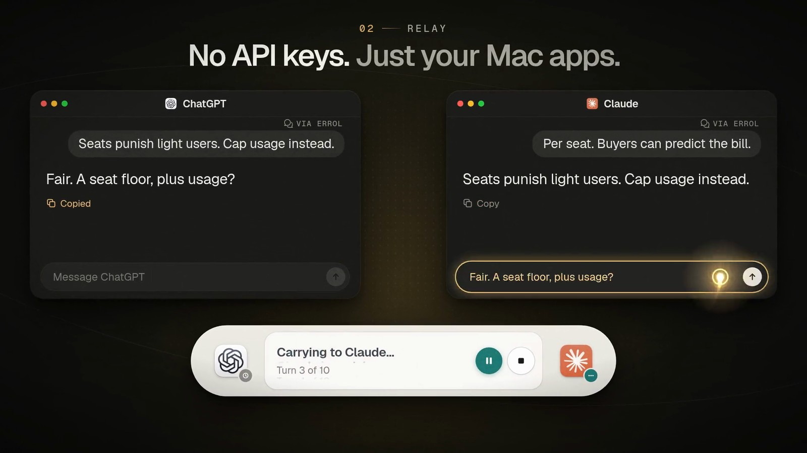

<h1 align="center">Errol</h1>

<strong>Let ChatGPT and Claude talk it out.</strong>

  A free, open-source menu bar app that carries a conversation 
  between the ChatGPT and Claude apps on your Mac.

  <a href="https://errol.chat/download"><strong>Download for Mac</strong></a>
  &nbsp;·&nbsp;
  <a href="https://errol.chat">Watch the 23-second film</a>

  

Errol puts two AI assistants in the same conversation, inside the apps you already use. Give it a topic, and it carries every reply from ChatGPT to Claude and back while you watch. Step in with a note whenever you like, or let them talk until they both agree they're done.

## Why Errol

If you use both ChatGPT and Claude, you've probably played messenger: copy an answer from one, paste it into the other, ask what it thinks, then carry the reply back. Some of the best answers come out of that back-and-forth, but you end up spending the whole time copying and pasting. Errol does the carrying for you.

It works through the desktop apps rather than their APIs, and that's the point. Each assistant stays in its own app, with its own memory, projects, tools, and model settings, on the subscription you already pay for. Nothing gets flattened into a bare model behind yet another chat window. The ChatGPT and Claude you've set up are the ones that talk.

The idea underneath is that the differences between assistants are worth something. A better answer doesn't always come from picking a winner. Sometimes it comes from letting two capable assistants challenge, extend, and check each other, while you set the purpose and stay in charge.

## What you can use it for

- **Compare notes.** Ask once, and let each assistant examine the other's reasoning instead of getting two answers that never meet.
- **Brainstorm past the first idea.** One proposes, the other extends, reframes, or pushes back.
- **Pressure-test a decision.** Let them argue a tradeoff, and watch the assumptions and open questions come out.
- **Review each other's work.** Point Codex in ChatGPT and Claude Code at the same project, and have one propose a change while the other looks for what it missed.
- **Just watch.** Two different assistants exploring a topic together is more fun than it sounds.

## How it works

1. **Open Errol from the menu bar.** It finds the ChatGPT and Claude windows you have open and connects to them. If an app has several, you pick the conversation.
2. **Give them a topic.** Choose who speaks first and when the conversation ends: when both assistants agree they're done, after a set number of turns, or when you stop it.
3. **Watch it unfold.** Errol introduces the assistants to each other, then copies each reply and delivers it to the other app. The console shows who's replying, what's on its way, and which turn you're on.
4. **Step in whenever you like.** Pause to add a note, and Errol delivers it with the next message. Stop at any time.

When the run ends, a summary of the conversation stays beneath the console, and the full replies stay in the two apps. Errol works in every mode of both apps: Chat, Work, and Codex in ChatGPT, and Chat, Cowork, and Code in Claude.

## Good to know

- **Errol drives the apps the way you would.** It uses macOS Accessibility to press each app's Copy button, paste into the other app's message box, and press Send. That's why it needs the Accessibility permission, and why there are no API keys or accounts involved.
- **It borrows your Mac while it runs.** A run brings each app to the front in turn and uses the clipboard, so leave the keyboard alone until it's done. Errol puts back whatever was on your clipboard. If you minimize a connected window or leave a draft in either app, the run pauses instead of typing over it, and carries on once the window is back or the draft is gone.
- **Your conversations stay between you and the two apps.** Errol has no account, no server, and no analytics. Messages reach OpenAI and Anthropic only through their own apps, as if you'd typed them. Errol itself goes online only to check GitHub for updates, and it keeps its logs on your Mac, in `~/Library/Logs/Errol/`.
- **Replies count against your plans.** Every message uses your ChatGPT and Claude allowances, so a turn limit is a good idea for long topics.
- **App updates can break it.** Errol finds buttons by their labels, so when ChatGPT or Claude changes its interface, Errol may need an update too. It checks for one every few hours. It also expects both apps in English for now.

## Get Errol

You'll need:

- macOS 26.4 or later
- The [ChatGPT app](https://chatgpt.com/download) and the [Claude app](https://claude.ai/download) for Mac, both signed in

Then:

1. [Download the latest DMG](https://errol.chat/download), open it, and drag Errol into Applications. Earlier versions are on the [Releases](https://github.com/tmarkovski/errol/releases) page.
2. Open Errol. Its icon appears in the menu bar, and the panel asks for permission to control your apps. Click **Open System Settings**, then drag Errol from the small panel under the System Settings window into the list above it, which is Device Control and Data Access on macOS 27 or Accessibility on macOS 26. Errol moves on to setup by itself.
3. Open a conversation in each app, type a topic, and press **Start relay**.

Errol checks for updates on its own and offers them between runs, never during one.

## Build from source

Errol is a Swift app. Open `app/Errol/Errol.xcodeproj` in Xcode 26.4 or later and run the Errol scheme. When you run it from Xcode, macOS may give the Accessibility permission to Xcode instead, so grant whichever app the prompt names.

The relay engine also builds as a Swift package, so `swift test` runs the detection tests without either chat app running.

[How Errol works](docs/how-it-works.md) covers the engineering: how the relay tells a reply is finished, the safeguards that keep it from typing into the wrong window, the test harnesses, and what's known about each app's accessibility tree. The website at [errol.chat](https://errol.chat) lives in [`site/`](site/).

## Where it's going

Errol starts with two apps, supported well. Other desktop assistants may join later, but only once Errol can carry their messages as dependably as it does for these two. Whatever gets added, every conversation should keep a clear beginning, a visible state, and a Stop button that works.

## Why "Errol"?

Errol is a messenger owl at heart: not the fastest courier, known to fly into the odd window, but the message always gets delivered. The name stuck after the very first test run, when the opening message missed its app and landed in the window where Errol was being written, introducing itself to its own author.

## License

Copyright © 2026 Tomislav Markovski.

Errol is free software under version 3 of the [GNU General Public License](LICENSE). You can use it, change it, and share it, commercially too, as long as anything you distribute stays under the same license with its source available.

The app includes [Sparkle](https://github.com/sparkle-project/Sparkle) and code adapted from [PermissionFlow](https://github.com/jaywcjlove/PermissionFlow), both of which come under their own licenses. Their notices are in [THIRD_PARTY_NOTICES.txt](app/Errol/Errol/THIRD_PARTY_NOTICES.txt), and a copy ships inside Errol.app.

The license covers the code. It grants no rights to the Errol name or symbol, so a version you ship needs a name of its own. The ChatGPT and Claude icons in `site/public/app-icons/` belong to OpenAI and Anthropic and aren't covered either.

Errol is an independent project and isn't affiliated with or endorsed by OpenAI or Anthropic. ChatGPT and Codex are trademarks of OpenAI. Claude is a trademark of Anthropic.
