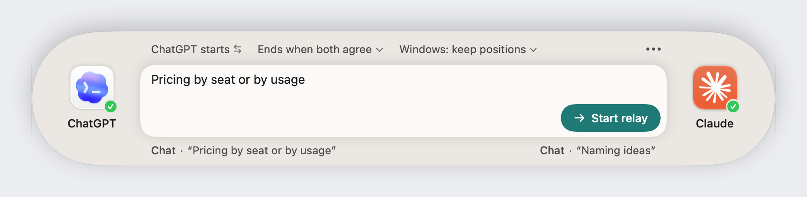
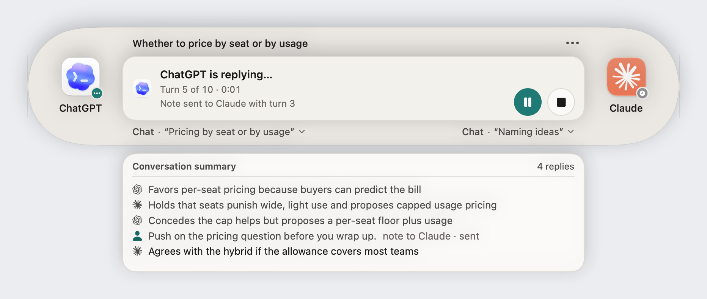
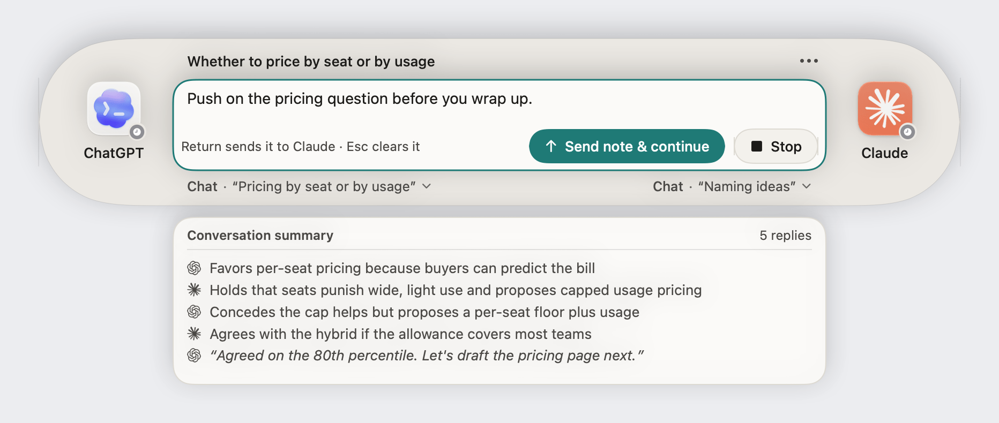
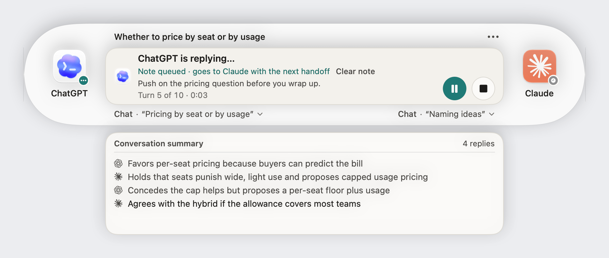
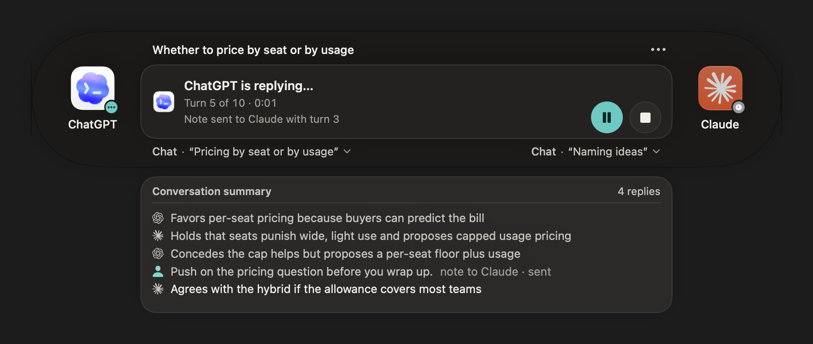
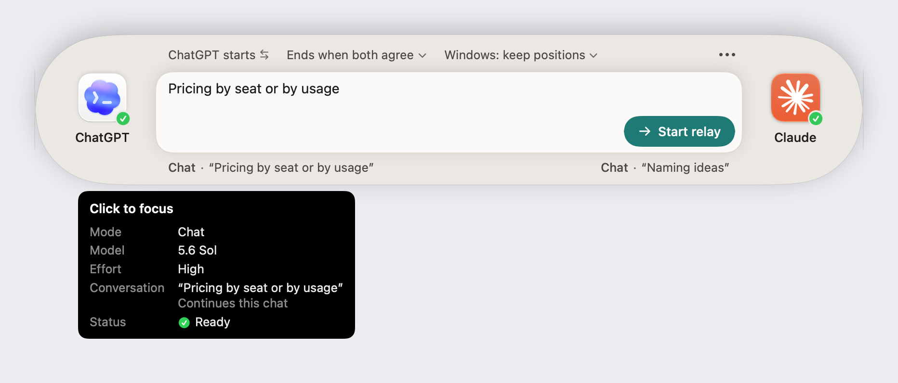
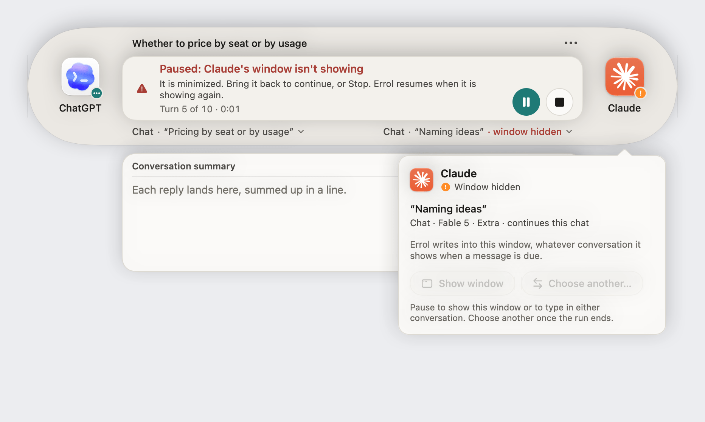
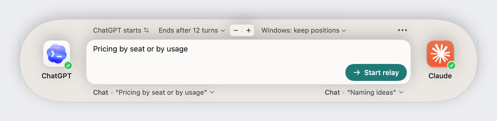

# Console implementation

Implemented September 24, 2026, against the [agreed design](README.md).

The capsule keeps its footprint and the two app icons. Participant names and badges stay stable; the surface and current destination title sit beneath the central box. A click on an icon focuses its app, and the pointer resting on it brings up the side's tip; the destination line under the box chooses the conversation. The starter, ending, and arrangement menus replace the Send-to control and unlabeled arrangement buttons. A shared native App menu is available from More and the status item. On narrow screens, ending and arrangement move under Run options so their labels remain readable.

## Refinements after review

- **The top row's menus read as text, not links.** They use the secondary ink rather than the accent, with a rounded-rectangle wash under the pointer. The ··· App menu and each side's destination line use the same chip. A chip hugs its value. Choosing another value springs the chip, and the chips after it, to the new width, while the text rolls to the new value and keeps the words the two values share in place. With Reduce Motion, the change is immediate.
- **Badges straddle the icon's corner.** Each badge is centered on the rounded corner of the app icon, not inside the artwork. Every state is a filled circle with a mark in it, set in a ring of the window's color:
  - ready is a white check on the system green;
  - needs attention is a white exclamation mark on the system orange;
  - replying is an ellipsis on the theme's accent, in the theme's on-accent ink;
  - waiting is a white clock on the system gray.

  A new state replaces the mark in place. The icon darkens slightly under the pointer.
- **A click on an icon focuses its app, and resting the pointer on it brings up a tip.** The details card that the icon and the destination line used to open is gone, and its Show window and Choose buttons with it.
  - A click brings the app forward, its connected window in front, and leaves the keyboard with it. While the app is closed, a click opens it.
  - After a short rest, the tip stands under the console, its outer edge on the icon's, and flips above near the screen's bottom edge. It is plain black with white text, with no edge, arrow, or shadow, and it never takes the pointer or the keyboard. A click puts it away until the pointer leaves the icon, and it closes with the console.
  - Its first line says what a click does ("Click to focus", "Click to open"), or why it can't ("Pause to focus", "Install Claude to use it"). Under it stand the window's mode, model, effort, conversation, and status, each only where the window has something to say. The model and effort are split apart from the line the app announces.
  - A side with nothing connected names its state ("Not connected", "Not running") instead of "Ready", and how many conversations it has open while none is chosen.
  - The destination line under the box lost its chevron and reads as a status. While it can, a click on it lists the app's conversations to choose from, the connected one checked, or opens the app, or brings it forward to open a conversation. Through a run it is a plain label. The hint in the box that asks for a choice points to that line.
  - A note's receipt still opens its card, paper with a hairline edge and an arrow on the line.
- **Three endings, with a stepper for the turn limit.** The ending menu offers **When both agree**, **After a set number of turns**, and **When you stop it**; the fixed list of turn counts is gone.
  - With a turn limit, a minus/plus stepper stands beside the chip, and its count rolls as it steps. It holds to repeat, takes the arrow keys, and adjusts as one control in VoiceOver.
  - When you stop it, the assistants are told the human will end the conversation, and a sign-off marker no longer ends the run. The status line reads "until you stop it".
  - In the narrow console, the ending and its stepper stay on the row, while who starts and the arrangement fold into Run options.
- **Who starts swaps with a click.** With only two choices, the starter chip has no menu: a click hands the first turn to the other app.
  - Swap arrows stand where a menu's chevron would, and make a half turn as the names change places.
  - The name rolls to the other one the way the other chips' values roll, and "starts" rides along at its end. In one text, the roll slid "starts" under the outgoing name.
  - The tooltip names what a click will do ("Let Claude start instead"), and VoiceOver reads "Who starts, ChatGPT" with the hint "Switches to Claude".
  - In the narrow console, Run options offers the same swap as one command.
- **A shorter ending.** The finished panel had repeated what the conversation summary shows.
  - It now keeps the headline and why the run ended ("both signed off", or what a stopped run was standing on). The reply count and the run's time moved to the summary's header, as "9 replies in 1:21".
  - A note's receipt stays on the panel only when the note never went: not sent, unconfirmed, or still being written when the run ended. The summary already lists a note that was sent, and a note the run ended with in the queue has no line there.
- **Soft shadows.** A very soft shadow all around lifts the prompt box off the shell, and a small one lifts each app icon. The badge is cut out of the icon's corner, so it takes no shadow of its own. The shadows are the same in every theme, a faint darkening on a light shell and a deeper one on a dark shell.
- **The line under the box lines up.** Its text starts where the prompt's does, as the top row's chips and the destinations do, and its bottom meets the buttons' bottom instead of centering on them.
- **A solid window instead of glass.** The panel fills with a new theme color, the shell, and the prompt box and the conversation summary stand lighter than it in both appearances.
  - In light themes, the shell is a tinted gray a step under the well. Paper and the well keep their values, and the hairline darkens enough to show on the shell.
  - In dark themes, the old paper became the shell, the well stays, and a new, lighter paper sits a step over it. Popovers and the round buttons are paper too, so they lighten with it.
  - Muted text is a shade darker in light themes, and the dark placeholder a shade lighter, so every text pair still meets 4.5:1 on all three surfaces.
  - Settings, the permission screen, and the log window take the shell as well. The icons no longer carry the white halo that lifted them off the glass.

Only the prompt and an acknowledged steering pause mount editors. Running, pending pause, queued note, recovery, and finished states use status panels. RunReport supplies the outcome and recovery instructions. The conversation summary keeps its scrolling view through pauses, has a header and reply count, and quotes original excerpts. Delivery receipt accounting is unchanged.

The unused Shapes editor is hidden. Palette values now live in Core with native color adaptation in Perch. Contrast corrections cover Classic Amber's button text, placeholder, muted and accent text, plus marginal placeholder or muted pairs in Ivory & Cobalt, Pearl & Teal, and Linen & Moss. All tested normal-text pairs meet 4.5:1 in both appearances.

## Focus behavior

A note's receipt opens its details in a non-activating panel, and a side's tip stands in a panel that takes neither the pointer nor the keyboard. The console, summary, details, and log windows check current focus-operation ownership before becoming key. Controls remain keyboard-accessible between handoffs; an active copy or delivery retains the keyboard. Neither panel activates a target app or changes the connection.

Showing an external window, from an icon or the destination line, requires an idle/finished relay or a granted steering hold, and leaves the keyboard with the app it focused. Because the ordinary worker remains occupied by a paused run, that action uses a dedicated worker while the existing hold stays set. The controller prevents Resume, a second window action, destination changes, and Start until its completion returns to the main thread. It preserves the note. Stop stays available. The worker checks that the hold still exists before acting. Selecting another destination and arranging/restoring remain unavailable for the whole active run.

Finder and Inspect are disabled during a run, as are update checks. Settings and the in-app log remain available without taking focus from an active relay operation. Returning from Settings restores an open note's focus.

## Verification

- Debug `xcodebuild` passed in an isolated DerivedData directory, without signing or replacing the installed app.
- `swift test` passed: 237 tests across both targets, with 2 opt-in live tests skipped and no failures. New checks cover focus/action availability, outcome symbols and warnings, current-window metadata, and 12 text/background pairs across seven palettes in both appearances.
- The refinements after review were typechecked against the whole app target, Sparkle included, with the project's concurrency settings, and rendered with the preview harness in both appearances. The hover wash, the tip's delay and live placement, and the receipt card's dismissal still need a hands-on check.
- The Xcode canvases, all in [PerchPreviews.swift](../../../app/Errol/Errol/Perch/PerchPreviews.swift), cover 31 states: 12 before a run, 4 tips, 10 during a run, and 5 endings, plus dark variants. Each stands the console the way the panel does, with the conversation summary under it once a run begins. The harness renders the same states in the same scene (`render <dir> canvas`), so its images show what the canvases show.
- The [native preview harness](../../../tools/console-preview/main.swift) compiles the actual views and controllers. Its assertions check pending versus granted pauses, refusal to show a window before the grant, preservation of the note and hold, and blocking Resume until the window action completes. Its fake engine sends no messages.
- Light and dark renders cover setup choices, app closed, Code destination, ready, running, pause pending, paused, queued note, held, completed, stopped, interrupted delivery, long titles, and the compact 600-point console. Images use the theme's own window color; only the window shadow is a stand-in.
- The solid window's colors are tested in every theme and both appearances: text pairs now include the shell, and a test keeps paper lighter than the well and the well lighter than the shell.
- `git diff --check` passed.

Live copy/send interactions with the desktop apps, VoiceOver navigation, and how the native shadow's rim sits on the solid window still need hands-on validation. The renders and preview assertions do not establish end-to-end macOS activation behavior.

## Rendered implementation

These images come from the app's views, not the earlier static proposal.










Regenerate locally:

```sh
tools/console-preview/render /tmp/errol-console-preview-images
tools/console-preview/render /tmp/errol-console-preview-images --dark
```

Optional numeric prefixes select states, for example `03 08 09 10 14 15 16 17`. The executable and module cache live in `/private/tmp/errol-console-preview`; set `ERROL_PREVIEW_BUILD` to choose another directory.
