# Console layout — converged spec

September 24, 2026. This is the layout Claude and Codex converged on after reviewing each other's
assessments of the Perch console, in a conversation relayed by Errol. It records the experience to build;
it does not report that the application implements it. Nothing under `app/` has changed.

The sources, in order:

1. [Codex's assessment](../../../output/ux-review-2026-09-24.md)
2. [Claude's assessment](../../../output/ux-review-2026-09-24-claude.md), with its renders and harness
3. [Codex's review of the merged proposal](../../../output/ux-review-2026-09-24-codex-peer-review.md),
   whose refinements and action table this spec adopts
4. [The earlier Codex alternative](../../../output/ux-review-2026-09-24-codex/earlier-layout.html),
   kept as history, not as the direction

The reviews sit in `output/`, which was untracked when this was written. Commit them with this spec, or
these links break.

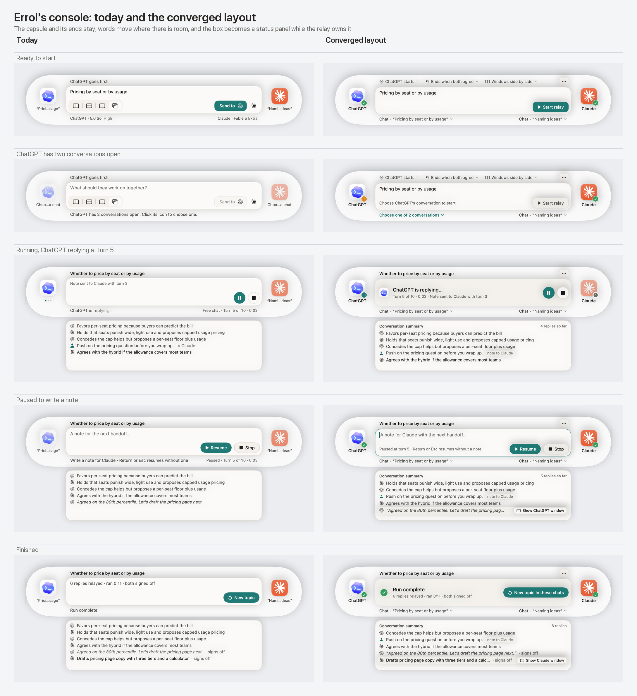

## Decisions

- **Keep the 860 × 156 capsule, the app icons at its ends, and the summary window under it.** The icons
  stay for identity, for the console's symmetry, and for showing who is speaking. They stop carrying text
  that does not fit and controls that cannot be seen.
- **Words go where there is room.** Each side's destination moves to the line under the box, on that
  side's half. The run's settings move above the box as labeled menus that show their values.
- **The box is an editor only when the person can type into it.** That means the prompt before a run,
  and the note once the relay has granted a pause. The rest of the time it is a status panel with no
  editable text control or insertion caret; its status text remains accessible.
- **Existing outcome and hold copy keeps its meaning in the new hierarchy.** Headlines and details come
  from `RunReport` and `RunBlock`. The success check is for a completed run only.
- **There is one participant popover, opened from an icon or from its destination.** Opening it changes
  nothing and activates no app. Its actions follow the run's actual hold, not the Pause click.
- **No new hidden gestures.** There is no double-click shortcut. Every action the popover offers is a
  visible button.

## The regions

### The ends

- Each end shows the installed app's icon (as today), a state badge at its lower trailing corner, and
  the app's name beneath it. App names always fit, so nothing here truncates.
- The badges are ready (a check), needs attention (!), replying (an ellipsis), and waiting (a clock). They
  differ in shape as well as color, each has an accessible state name, and the same state is said in
  words on the destination line or in the status panel.
- Readiness is no longer shown by fading the icon. During a run, the side that is not speaking may still
  dim slightly as a secondary cue; the badge carries the state.
- A click, or Return or Space with focus, opens the participant popover.
- While an app is closed, the box keeps today's explicit **Open ChatGPT** or **Open both apps** in place of
  Start relay. The popover offers **Open** as well.

### The top row

- **Before a run** it holds three menus, each showing its current value:
  - **ChatGPT starts ▾** chooses who receives the topic first. This replaces the Send pill's inside and
    outside marks and the "ChatGPT goes first" line.
  - **Ends when both agree ▾**, or **Ends after 10 turns ▾**, holds the choices that live only in the
    menu-bar menu today.
  - **Windows side by side ▾**, or **Windows: keep positions ▾**, lists the layouts and applies the one
    chosen, as the segmented control does today, plus Restore window positions. The four unlabeled icons
    leave the composer's toolbar.
- **During and after a run** it holds the topic sentence the on-device model writes, as today.
- **In every stage**, a small **More** button (···) stands at its trailing end, with the accessible name
  "App menu". It offers:
  - Settings…
  - Show Last Run Log
  - Show Debug Logs in Finder
  - Inspect Apps
  - Restore Window Positions
  - Check for Updates…
  - Quit Errol

  Items that touch the apps or the windows are off during a run, as they are in today's menu. The
  menu-bar icon's menus stay. Opening Settings during a run obeys the same focus ownership as everything
  else: it neither resumes nor stops the relay, and a note being written survives it.

### The box

| Stage | What the box holds | Actions |
| --- | --- | --- |
| Composing | The prompt editor | **Start relay**. When it is unavailable, the reason stands beside it ("Choose ChatGPT's conversation to start"), and a refused start shows its reason there too. |
| Running | Status panel: the speaker's own app icon, "ChatGPT is replying…" or "Sending ChatGPT's reply to Claude", then the turn, the clock, and the last note's receipt | Pause to steer and Stop, as round buttons |
| Pause pending | Status panel: "Pausing after the current handoff…", then what is still finishing, the turn, and the clock | Pause disabled, Stop |
| Paused (hold granted) | The note editor, with a cursor and an accent outline, and the key hint beside the actions | Resume (Send note & continue once the note has words) and Stop |
| Note queued | Status panel: the running headline, then "Note queued · goes to Claude with the next handoff" with **Clear note**, then the note | Edit note and Stop |
| Held | Status panel: a warning icon and the `RunBlock` headline in red ("Paused: Claude's window isn't showing"), then its recovery text | Pause and Stop |
| Finished | Status panel: the outcome's icon, the `RunReport` headline, and its detail | **New topic in these chats** |

The finished icons follow the outcome. A completed run gets the check. A stopped run or a reached turn
limit gets a neutral mark, because those endings were chosen. Every outcome that needs checking gets a
warning:

- a timeout;
- a failed copy;
- a refused or interrupted delivery;
- an empty reply;
- a lost conversation.

The detail keeps its instruction, for example "focus was lost mid-send; check whether the message went".
When an outcome concerns one side, that side's destination says so too ("check delivery").

The focus alert (`PerchFocusAlert`) stays as it is, covering the capsule while an app will not come to
the front.

### The destination line

- There are two halves, one per side, each under its own icon: ChatGPT's at the leading edge, Claude's at
  the trailing.
- The content comes in priority order:
  - the surface (Chat, Work, Codex, Cowork, Code), which never truncates;
  - the conversation's title, truncated in the middle so similar titles keep the ends that tell them
    apart;
  - a short state, only when the side has one: "window minimized", "unsent draft", "check delivery".

  Model and effort move to the popover and the tooltip.
- A side that needs something says so in the accent color, in place of the title: "Choose one of 2
  conversations ▾", or "Open a conversation in ChatGPT".
- A remembered destination that no sweep has verified yet reads "Last used · “Title”" in muted text. It
  is never styled like a verified destination.
- The title is what the connected window shows now, because the connection is the window.
- A click opens the participant popover.

### The summary window

- It stays where it is today: its own window under the console, as wide as the box and 156 pt tall. It
  shows from the start of a run until New topic, and it stays visible and keeps its scroll position through
  pause and resume.
- A header reads "Conversation summary", with the reply count at its trailing end.
- Rows come in three kinds:
  - the model's line;
  - a reply shown whole, in quotes and italics;
  - a note, tagged "note to Claude".

  A fallback excerpt that is cut short keeps both quote marks, with the ellipsis inside them. A note
  that is still queued stays in the status panel. Once the worker commits its handoff, the summary row
  appears as **Sending**, then records **Sent**, **Unconfirmed**, or **Not sent** from the delivery
  receipt. Preserve today's **Not sent** record for a refused or oversized note even if it never reached
  the handoff. Do not require confirmed delivery before recording an attempted note
  (`RelayController.steeringCommitted` and `noteOnTranscript`).
- **Show ChatGPT window** or **Show Claude window** appears on the focused or hovered row once a pause is
  granted, or after the run. It is keyboard-focusable. It brings the connected window forward and makes
  no promise to scroll to that reply, or to a conversation the window no longer shows.

### The participant popover

- It shows:
  - the app and its state, in words and as a badge;
  - the conversation's full title;
  - the surface, model, and effort;
  - whether this continues a chat or starts a new one;
  - one sentence: "Errol writes into this window, whatever conversation it shows when a message is due."
- Its actions are **Show window**, **Choose another…** (the app's eligible windows, as the icon's menu
  offers them today), and **Open** when the app is closed. An action that is unavailable stays visible
  and disabled, with the reason under it.

## Action availability

"Pause granted" means the relay has granted the hold. That is either an immediate grant, or a pending one
that has been resolved: `isSteering` is set and `isSteeringPending` is clear. Clicking Pause alone is not
enough (`RelayController.beginSteering()`, `.afterOperation`).

| Action | Composing / finished | Running or pause pending | Pause granted |
| --- | --- | --- | --- |
| Open the participant popover | Available | Available; activates no app | Available |
| Show window (popover or summary row) | Available | Unavailable: "Pause to show this window" | Available; keeps the hold and the note draft, and hands the keyboard back to the note |
| Choose another destination | Available | Unavailable | Unavailable until the run ends |
| Who starts, ending, window layout | Available while composing | Unavailable | Unavailable until the run ends |
| Arrange or restore windows | Available | Unavailable | Unavailable until the run ends |
| App menu | Available | Available; Inspect Apps and updates are off | Available; the same |

Show window reuses the bring-forward path setup already has (`SetupController.bringForward`), which
hands the keyboard back to the console once the app is in front. It is gated by the same focus and hold
coordination as the relay (`docs/design-proposals/steering/focus-coordination.md`). The popover's own
focus behavior must not take focus that a copy or delivery in progress needs.

## Copy changes

| Today | Converged |
| --- | --- |
| "ChatGPT goes first", plus the Send pill's inside and outside marks | "ChatGPT starts ▾" |
| Send to [mark] | Start relay |
| New topic | New topic in these chats |
| "Pause before typing in either conversation." in the closed field | The status panel says what is happening. The reminder not to type into the apps moves to the panel's secondary line, or to the popover. |
| "Free chat" in the run's line | Removed until conversation shapes can be picked again |
| "Each reply lands here, summed up in a line." | "Conversation summary" header. The empty state can keep this sentence. |

## Accessibility and contrast

- Badges have accessible state names. No state depends on color alone.
- While the relay owns the box it has no editable text control or insertion caret; static status text
  remains accessible. Only the prompt editor and a granted note editor are editable.
- More is announced as "App menu". The popover is labeled with the app's name, and its disabled actions
  carry their reasons.
- **Contrast test.** Check the normal-text foreground and background pairs the UI actually uses, in light
  and dark appearance, against 4.5:1. The pairs are:
  - ink, secondary, placeholder, and accent text on paper;
  - muted text where it sits;
  - the text on the accent;
  - red on paper.

  The palettes are `NSColor` tables in `Perch/PerchPalette.swift`, in the app target, and `swift test`
  only builds `Core/`. So move the hex tables into `Core` as plain values, map them to `NSColor` in
  `Perch`, and test them in `tests/ErrolKitTests`.
- **Classic Amber light fails today.** White on its accent `#D98E2B` is 2.67:1. Give it a dark `onAccent`,
  and darken its placeholder and muted inks until the test passes.

## Housekeeping

- Hide the conversation-shapes editor in Settings until the console offers the picker again.
- Wire `RelayController.openSettings()` to More → Settings, or delete it. Nothing calls it today.
- The README's UI sections already describe removed parts of the console, a separate task has been
  flagged for that, and this layout should be described there once it is built.

## Unchanged, or out of scope

- The Liquid Glass surface, the transfer animation, the veils (disabled), the focus alert, and the
  permission screen stay as they are.
- The drag from an icon onto a chat window to connect it stays deferred; that gesture is still to be
  designed. Connecting stays as it is today: a lone eligible window connects on its own, and otherwise
  it's chosen from the popover.
- Dark appearance has not been rendered and needs a visual check. So do the glass surfaces, which the
  renders show as a flat stand-in.

## Acceptance images

The ready, running, paused, and finished states are shown next to today's console at the top of this
spec. These are all thirteen states in the converged layout.

<table>
<tr><td>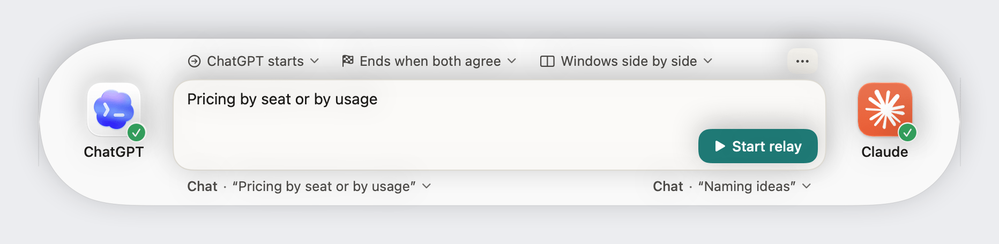 01 · Ready to start</td>
<td>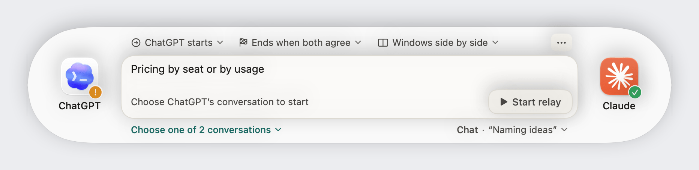 02 · A side needs a destination chosen</td></tr>
<tr><td>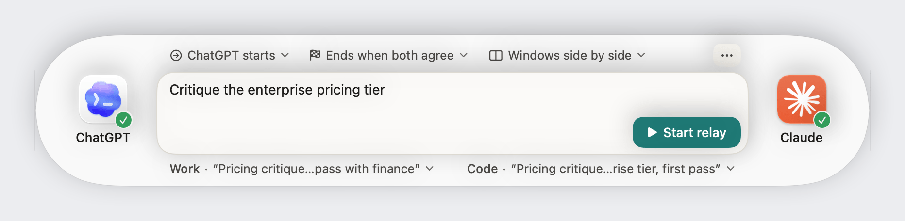 03 · Long, similar titles</td>
<td>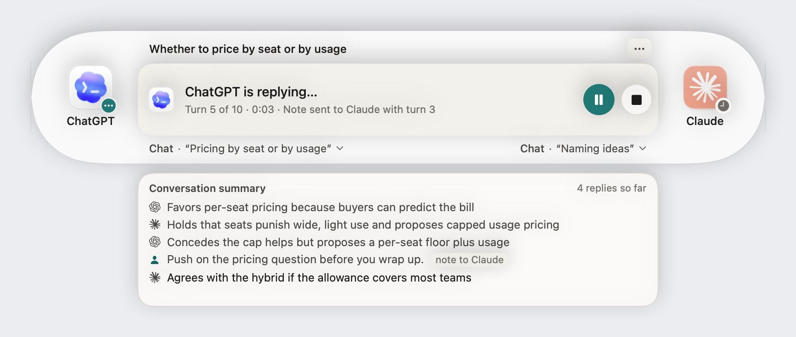 04 · Running</td></tr>
<tr><td>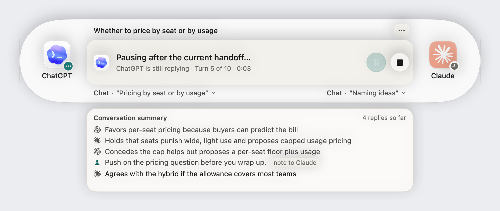 05 · Pause pending</td>
<td>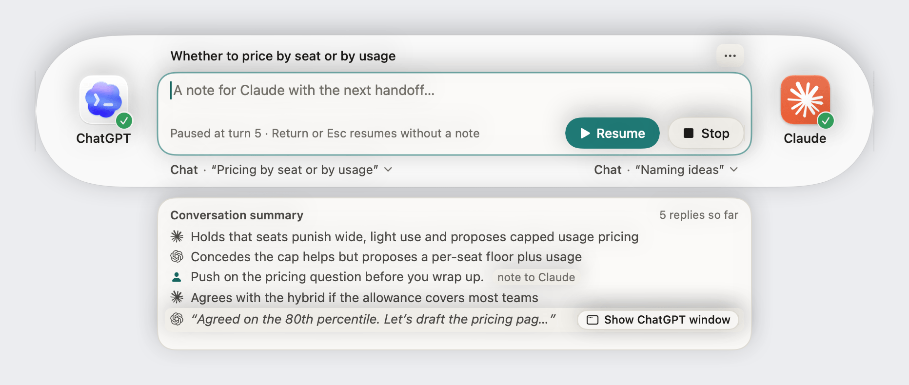 06 · Paused, summary kept, row action shown</td></tr>
<tr><td>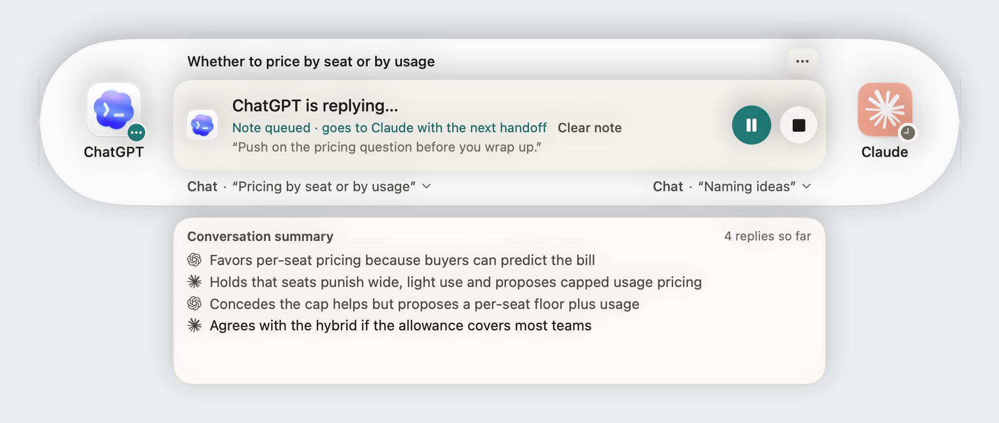 07 · Note queued</td>
<td>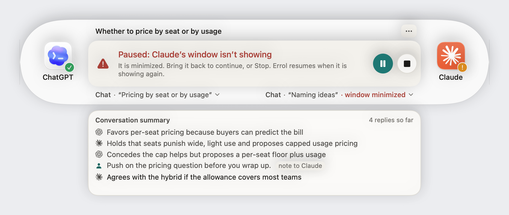 08 · Held: a window is minimized</td></tr>
<tr><td>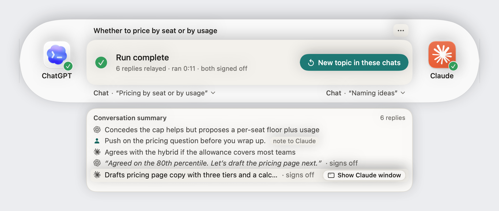 09 · Finished: complete</td>
<td>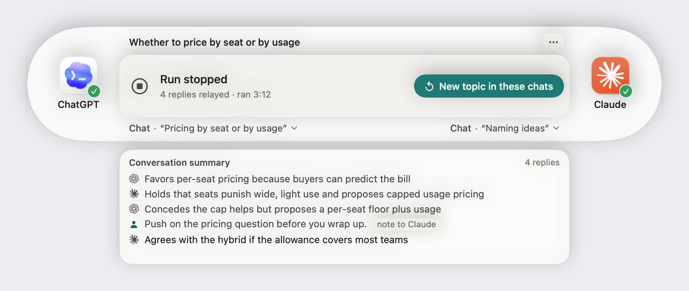 10 · Finished: stopped</td></tr>
<tr><td>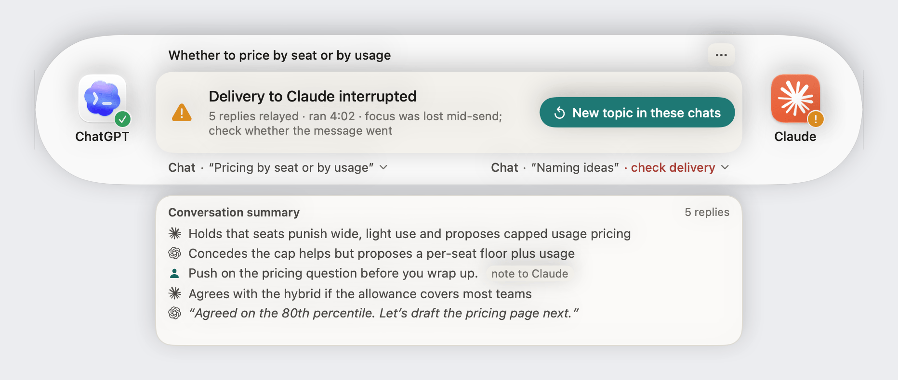 11 · Finished: delivery interrupted</td>
<td>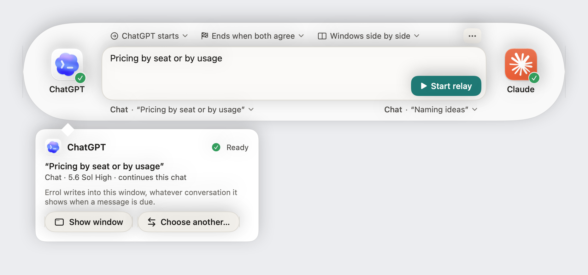 12 · Participant popover</td></tr>
<tr><td>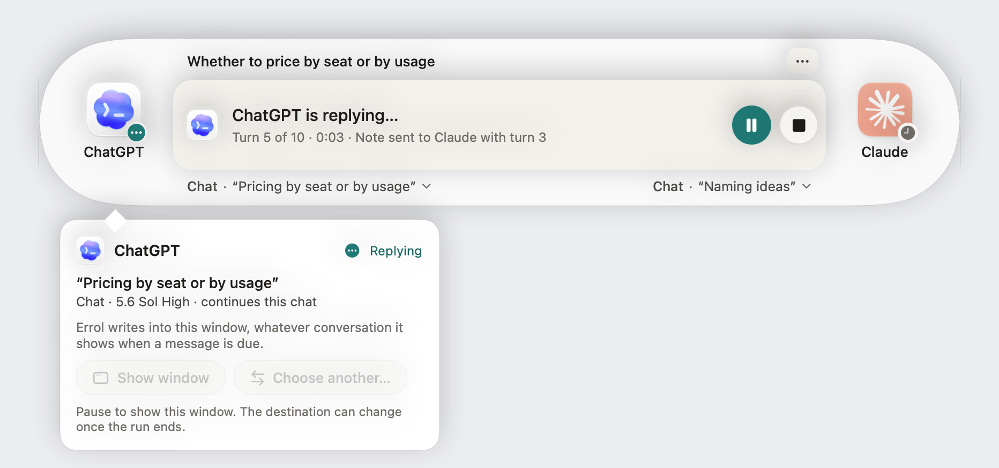 13 · Participant popover during a run</td>
<td></td></tr>
</table>

## Validation

Before or alongside building this, run the formative test from Codex's assessment: a small group of
people new to Errol, doing six tasks, with the ends compared against a participant row above the prompt.
Direction B in Claude's assessment is that row. Keep labels identical across both placements, so that a
better label is not mistaken for a better placement. Record wrong-destination choices, wrong predictions,
hesitation, and reliance on tooltips, and also:

- whether people can name both destinations without hovering;
- whether anyone tries to type into the box during a run;
- whether they can say who starts before pressing Start relay.

## Where it lands in the code

This is orientation for whoever builds it, not a plan.

- `Perch/PerchParticipant.swift`: the icon opens the popover, in place of the role-based click and the
  context menu. A badge replaces opacity as the readiness signal.
- `Perch/PerchConsole.swift`:
  - `PerchTopicLine` becomes the top row: the selectors or the topic, plus More.
  - `PerchConsoleStatus` and `PerchSurfaceLabels` become the destination line, which is always shown. Setup
    notices move to the side they concern, or beside Start relay.
  - `PerchLayoutSegments` becomes the Windows menu.
  - `PerchPromptBox`'s closed field and ending become the status panel.
- `Perch/PerchSendPill.swift`: replaced by the "starts" menu and Start relay.
- `Perch/PerchTranscript.swift`: the header, the row action, and excerpt quoting. It stays shown through
  a pause.
- `MenuBarController.swift`: one App menu, shared by More and the status item. The session options leave
  the right-click menu once they are on the console.

## How the images were made

The "today" images are the app's own Perch views, driven by `PerchPreviewEngine` and rendered offscreen.
Everything in the converged layout is a static SwiftUI mock built from the same components: avatars,
marks, palette, and buttons. Wherever a state already has copy, the mocks use the app's own words, from
`RunReport` and `RunBlock`. The Liquid Glass surface shows as a flat near-white fill.

The sources are in [`harness/`](harness/):

- `main.swift` renders today's console.
- `mocks.swift` renders the two directions and the first merged proposal.
- `final.swift` renders these images.

Build it from the repo root the way `output/ux-review-2026-09-24-claude.md` describes, adding
`final.swift` to the sources, then run it with `--final`. `montage-final.py` and `compress-final.py`
compose the comparison sheet and reduce the PNGs, which libimagequant does while keeping the colors
faithful.
