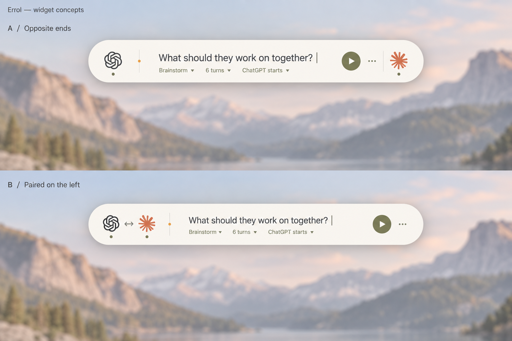
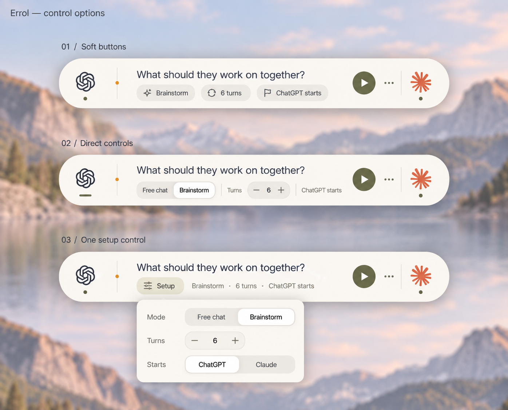
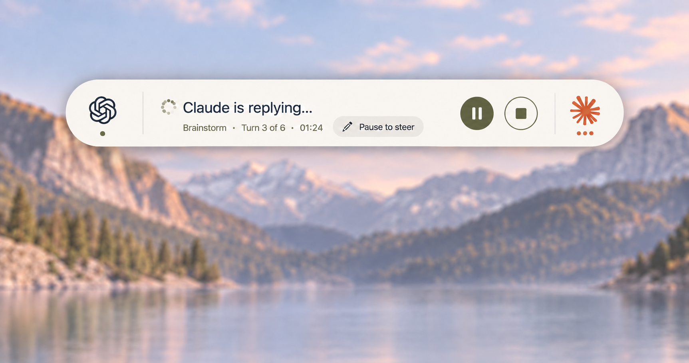

# Floating conversation widget

Design selected September 8, 2026. These images were generated with the built-in
image generation tool during the design conversation. They are concept references,
not screenshots of the running application.

## Direction

The main console is a low, wide capsule, with an app mark at each end and one
shared composing surface between them. It opens horizontally centered near the
top of the active screen and retains the native macOS shadow. The shadow's fine
rim is intentional; there is no additional border or title bar.

- **Idle (revised September 9):** the prompt is the only content in the center.
  One sliders button immediately before Run opens Settings: conversation shapes,
  custom prompts, automatic ending or a turn limit, starting app, window tiling,
  theme, appearance, and the conversation-shape editor. Clicking either
  participant also chooses who starts. The menu remains available during a run,
  with conversation options disabled until it ends.
- **Settings:** a compact panel with Conversation and Appearance tabs and a
  fixed height. Conversation uses a shape dropdown, segmented starting-app and
  ending choices, an always-present inline turn count, and tile/restore and edit
  commands. Appearance groups System/Light/Dark above a grid of palette swatches.
  Switching tabs or enabling the turn limit does not resize the panel.
- **Typing:** the prompt shrinks from 19 to 15 design points (20.9 to 16.5 native
  points at the current scale) before soft wrapping. It grows to three visible
  lines, then scrolls internally. Deleting text restores the larger type. Custom
  instructions and steering notes use the same sizing.
- **Running:** who is replying, the mode, turn count, elapsed time, and Pause to
  steer. Pause is filled; Stop is outlined, the same size, and follows Pause.
  Both are icon-only, vertically centered, with tooltips and accessible names.
- **Steering:** the same center becomes a native editor after the relay grants
  focus. Sending and continuing use the existing handoff protocol. Queued notes,
  delivery receipts, pending pauses, and stop requests retain explicit feedback.
- **Finished:** the outcome and run summary remain until New session.
- **Navigation:** Settings and Accessibility setup remain in the same window;
  Settings animates to a taller card and back. Permission setup takes the
  console's capsule, with the request at the leading end and the action at the
  trailing end, and crossfades into the console once access is granted. Prompt
  growth is bounded by three lines.

The production view uses the selected theme. App marks are read from installed
apps when available, with their app icon as fallback; generated logos are not
application assets.

## Concept images

### Layout alternatives

The opposite-end arrangement was preferred for its stereo-like silhouette.

### Configuration controls

The original direction used direct controls. The September 9 revision consolidates
them in the sliders popover beside Run, leaving the writing surface clear. These
concept images record the earlier alternatives.

### Running

The final correction removed Pause and Stop captions and centered the buttons.

[Earlier running version with labels](03-running-with-labels.png) is retained as
part of the decision history.

## Image prompts

Generated with the built-in image generation tool; these are the prompt briefs:

1. Compare a fully rounded, wide, low Errol widget with ChatGPT and Claude at
   opposite ends versus paired on the left. Keep an ivory surface, native shadow,
   central prompt, compact configuration, and a moss Run button, floating near
   the top center of a macOS desktop.
2. Preserve the opposite-end widget and compare soft option buttons, direct
   segmented controls with a turn stepper, and one setup popover. Remove dropdown
   triangles and keep all three examples at the same size.
3. Show the direct-control widget during a run: Claude replying, current turn,
   clock, Pause to steer, a filled Pause circle and matching outlined Stop.
4. Remove only the Pause/Stop captions and center those icon buttons vertically;
   preserve the remaining layout and the Pause to steer label.
