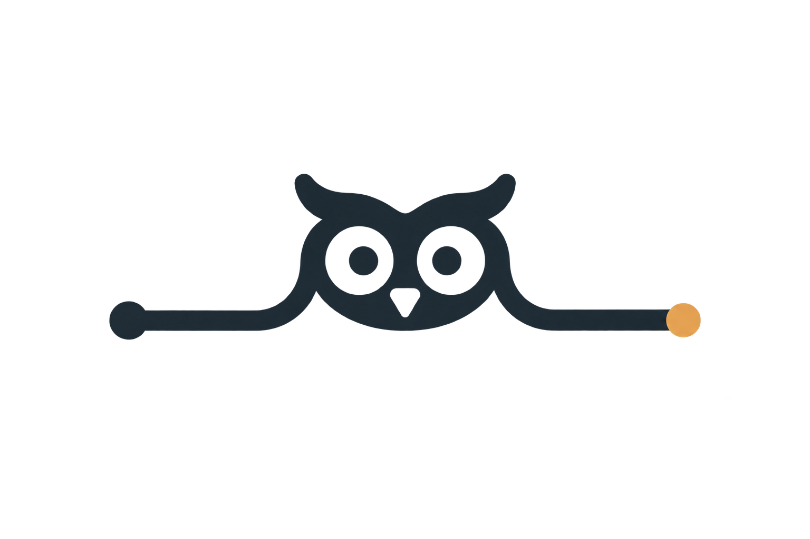

# Errol logo concepts

These are raster explorations for choosing a direction, not production-ready logo files. The chosen route should be rebuilt as a precise vector, tested at menu-bar size, and reduced to a true one-color glyph before it replaces the current system bird icon.

The studies follow the existing brand direction: an original messenger owl, the visual idea of a quiet courier between two conversations, and a balance of warmth with dependable Mac-utility precision. They deliberately avoid fantasy or franchise-associated cues.

## 1. Dialogue owl

Two speech bubbles become the owl's eyes, with the delivery point at the center. This is the most direct translation of the product and the closest to the current brand brief. It should be simplified further for small sizes.

## 2. Relay loop

Opposing message arrows create the owl face and communicate back-and-forth movement. **This original generated image is the selected working direction.** Its thick-ringed eyes, loose arrow geometry, and owl-like character were weakened by the later refinement attempts.

The later [generative variants](relay-loop-variants/README.md) and [vector redraws](relay-loop-vector/README.md) were rejected and are retained only as exploration history.

## 3. Route line

A continuous path connects two endpoints and briefly becomes an owl in the middle. This is a strong motion-system idea for the website or delivery animation, but it is currently too wide and subtle to serve as the primary app icon.

## 4. Pocket courier

A compact, slightly off-balance courier holds the delivery point. This is the warmest route and a good basis for onboarding, empty states, and delivery moments. It is better treated as the mascot layer than as the primary menu-bar glyph.

## Prompt set

All four images used the built-in image-generation workflow and the `logo-brand` use case. Shared constraints were: original artwork only; the Errol palette; a strong silhouette; no text; no franchise cues; and suitability for both a macOS app icon and a simplified monochrome menu-bar glyph.

- **Dialogue owl:** two mirrored speech bubbles form the owl's eyes, with a central beak or delivery point made from negative space.
- **Relay loop:** opposing message arrows form a compact owl head around two simple eye cutouts and a small central delivery point.
- **Route line:** one continuous path runs between two conversation endpoints and forms a minimal owl in the middle.
- **Pocket courier:** a compact owl in a slightly off-balance landing pose holds a small delivery point close to its chest.
