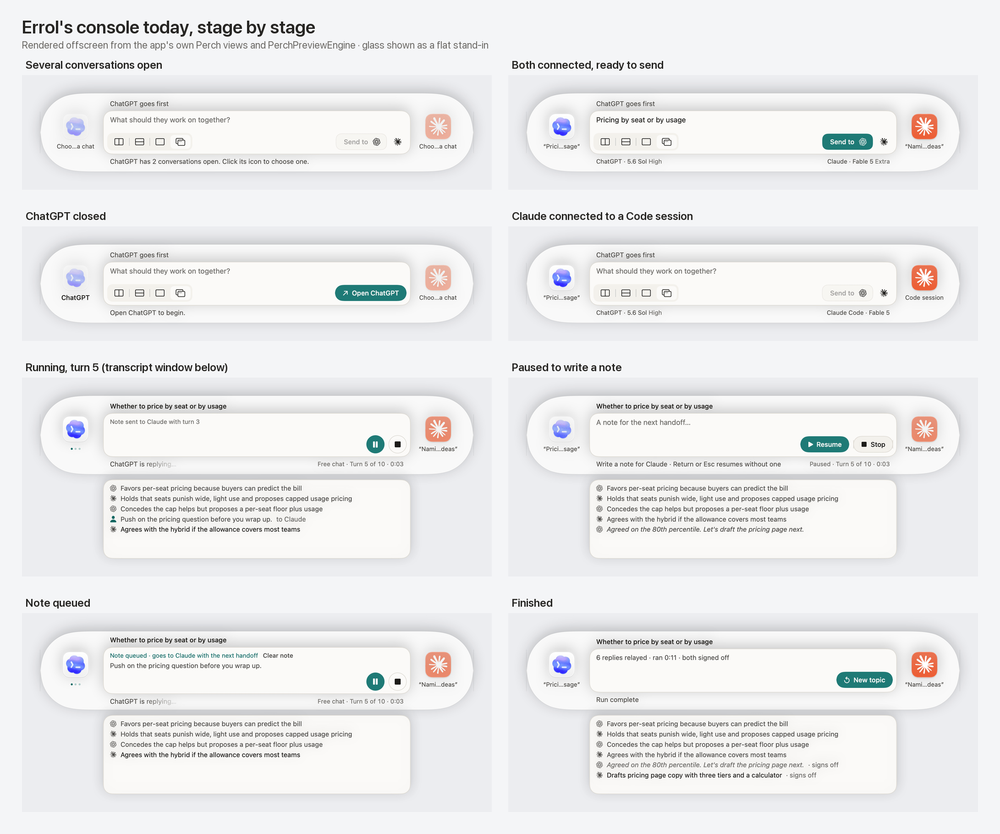
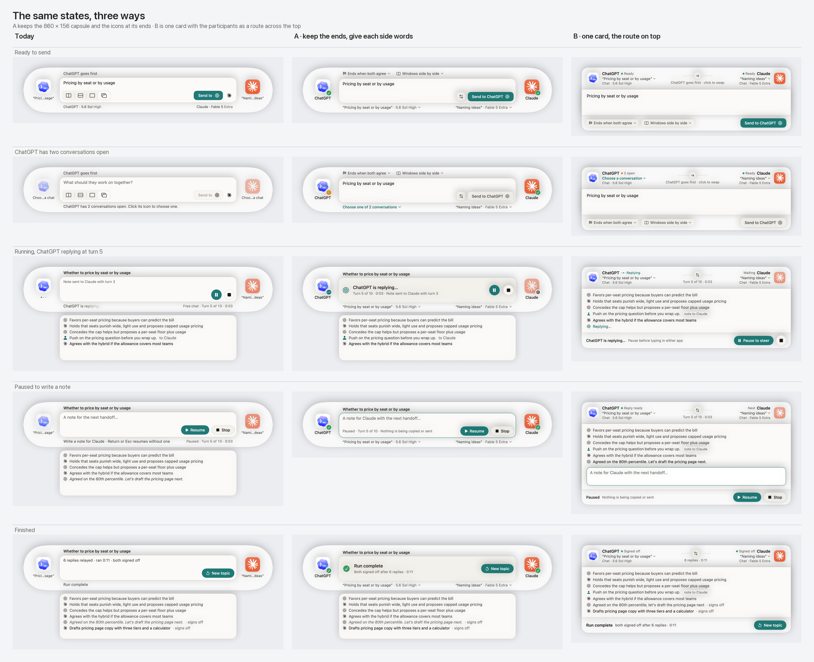

# Errol console: layout and usability review (Claude)

> **Superseded by the converged spec**,
> [`docs/design-proposals/console-layout/README.md`](../docs/design-proposals/console-layout/README.md).
> The spec folds in Codex's [peer review](ux-review-2026-09-24-codex-peer-review.md): the surface and
> title come before model details, the summary stays visible while paused, popover actions follow the
> relay's hold, and the endings are specific to each outcome. The spec also has thirteen updated
> renders. This review and its images are kept as the record of how the design got there.

Date: September 24, 2026. This is the companion to Codex's review in
[`ux-review-2026-09-24.md`](ux-review-2026-09-24.md). The images are in
[`ux-review-2026-09-24-claude/`](ux-review-2026-09-24-claude/).

## Summary

Keep the capsule and the app icons at its ends, but give the icons a smaller job. They work well as each
app's identity, as the console's symmetry, and as the signal of who is speaking. They work poorly as the
place where each side's details and controls live, and most of the console's usability problems trace
back to that. The capsule itself doesn't need to go. What needs rethinking is what the side columns hold
and how the prompt box is reused during and after a run.

The converged proposal at the end of this document folds Codex's review into my Direction A. It is shown
next to today's console in [`compare-today-converged.png`](ux-review-2026-09-24-claude/compare-today-converged.png).

## How this was produced

The console was never built or launched; an agent build breaks Errol's Accessibility grant. Instead, the
app's own Perch views were compiled in a scratchpad harness, driven by `PerchPreviewEngine`, and rendered
offscreen. That harness compiled every app source except `ErrolApp.swift`, `MenuBarController.swift`, and
`UpdaterController.swift`, with `-D DEBUG`. So the current-state images are the real views in real
states, not redrawings. No relay ran and neither chat app was touched.

Some things can't be rendered this way. Liquid Glass and materials show as a flat near-white stand-in,
and the focus alert's blur is missing, so that state is left out of the sheets. Hover and animation are
not captured. The app icons are the ones installed on this Mac, and ChatGPT's shows the Codex artwork
because of its Dock preference. The two alternatives and the converged proposal are static SwiftUI mocks
built from the same components (avatars, marks, palette, buttons), so they compare like for like with
the renders. This is an expert review; no one unfamiliar with Errol has used any of it.



## What works

- There is one primary action per stage, always in the same corner of the box: Send, then Pause, then
  Resume, then New topic. The capsule never changes size, so nothing moves under the pointer.
- The copy is specific and tells people what to do. Examples are "ChatGPT has 2 conversations open.
  Click its icon to choose one." and "Write a note for Claude · Return or Esc resumes without one".
- The transcript's one-line summaries let someone follow the exchange without reading either chat
  window. That is the most useful thing on screen during a run.
- The paused state is the strongest screen. The box really is an editor there, its buttons have labels,
  and the line under it says what the keys do.
- The safety model behind the UI is sound: explicit destinations, drafts left alone, and holds that say
  why. The problems below are about where information is shown, not whether the app has it.

## Findings, most important first

### 1. You can't read which conversation Errol will write into

The destination is the fact the whole safety model depends on. It is shown in a 79 pt column under each
icon, in one line, truncated in the middle, so real titles render as "Prici…sage" and "Nami…deas". Even
the instruction "Choose a chat" becomes "Choo…a chat". The full text exists only in a tooltip and in the
accessibility value, so VoiceOver users get more than sighted users do.

Evidence: `Perch/PerchStyle.swift:96`, `Perch/PerchParticipant.swift:184`, `:207`.

### 2. Each side's details are spread over three places

The conversation name sits under the icon. The surface and model sit at the edges of the line under the
box, and only while nothing else needs saying there, so they never show during a run. Problems go in
that same central line, one side at a time, ChatGPT first. To answer "is Claude ready, and where will it
write?" you have to look in three places, and sometimes the answer isn't on screen at all.

Evidence: `Perch/PerchConsole.swift:148`, `Core/Setup.swift:451`.

### 3. Readiness is shown only by fading the icon, and faded looks disabled

Before a run, an icon at 45% opacity means "not ready". During a run, 70% means "not speaking". The same
visual means two different things, and neither is stated. Worse, the faded icon is often exactly what
you need to click, to open the app or choose a chat, which is why the status line has to say "Click its
icon". The click itself does different things by state: it opens the app, brings a window forward, or
shows a menu. Changing a connected conversation is only in the icon's right-click menu.

Evidence: `Perch/PerchParticipant.swift:93`, `:132`.

### 4. During a run the prompt box looks like an empty text field

"Pause before typing in either conversation." is drawn in the placeholder's color and size, inside the
same paper box as the editor. So it reads as somewhere to type, while telling you not to. The largest
area on the console holds the least important text, and later a stale "Note sent to Claude with turn 3".
What's actually happening ("ChatGPT is replying…", the turn, the clock) is in the smallest type under it.

Evidence: `Perch/PerchConsole.swift:386`.

### 5. The finished state is upside down

"Run complete" sits in the small line under the box. The detail it summarizes ("6 replies relayed · ran
0:11 · both signed off") sits in the box above it, in larger type.

Evidence: `Perch/PerchConsole.swift:176`, `:410`.

### 6. Setup choices are in the wrong places

The four unlabeled window-layout icons sit in the composer's toolbar, where people expect attachment or
formatting controls, and they move the chat windows the moment one is clicked. The turn limit, Restore
Window Positions, and Settings exist only in the menu-bar icon's right-click menu, and nothing on the
console hints that they exist. `RelayController.openSettings()` has no callers. The run line says "Free
chat", a mode that can't be picked right now, while Settings still edits conversation shapes the console
doesn't offer.

Evidence: `Perch/PerchConsole.swift:555`, `:231`, `MenuBarController.swift:172`, `:221`,
`RelayController.swift:333`, `SettingsView.swift:4`.

### 7. Who goes first is said twice, and the control that changes it is unclear

"ChatGPT goes first" sits above the box. The Send pill says "Send to" plus a mark, and the way to swap is a
bare Claude glyph beside the pill, with no container and only a tooltip to explain it.

Evidence: `Perch/PerchSendPill.swift:70`, `:98`.

### 8. ChatGPT appears as three different marks

The end icon is the installed app's icon, which on this Mac is the Codex cloud. The Send pill and the
transcript use the flat OpenAI mark, and the text says "ChatGPT". Wherever a mark stands alone, the name
should be written out beside it.

## The icons at the ends

The opposite-ends layout was chosen for its look: the widget proposal says it "was preferred for its
stereo-like silhouette". The usability case for it is thinner than it seems. Matching each icon to its
window's side only helps when the windows are side by side, but the default layout is Keep positions
(`Core/Setup.swift:318`). Under Stage Manager, where each app fills its own stage, there is no left or
right at all. The two columns and their insets also take about 250 pt of the capsule's 860 pt to show
two icons and two truncated words.

So the icons should stay, for identity, for symmetry, and for showing who is speaking, but the words and
the controls should move somewhere with room.

## Two directions



**A: keep the ends, give each side words.** This keeps the 860 × 156 capsule and the icons.

- The line under the box stops being a status line. It becomes a permanent pair of halves, each showing
  its side's conversation and model with a chevron that opens the chooser.
- Each icon gets a small badge (ready, needs attention, replying, waiting) instead of being faded, and
  its label is just the app name, which always fits.
- The options move above the box as labeled menus.
- During a run the box becomes a recessed status panel that can't be mistaken for an input.

**B: one card, the route across the top.** Each app becomes a labeled chip in the header, with an arrow
between them that shows who goes first. The editor, then the transcript, fill the middle, and the
actions sit in a footer. It is the most coherent structure, but it gives up the capsule, and the card
has to grow during a run.

I recommended A, because every finding above is about what the side slots hold and how the box gets
reused, not about the capsule's shape. B is the variant worth testing against it.

## Reading Codex's review

### Where we agree

Codex and I reached the same top findings independently:

- the destinations are illegible and their details scattered;
- the icons' actions are unclear, and the faded look contradicts the click;
- the swap control for who starts is unusual;
- the running state's main content has less emphasis than it deserves;
- the window-arrangement control is in the wrong place;
- the shapes editor has no effect;
- keep the capsule and the ends, and treat a participant row above the prompt as the alternative to test.

### Where Codex changed my position

- **"ChatGPT starts ▾" and "Start relay".** Codex is right that "Send" describes the first delivery and
  understates the minutes-long process it starts. A labeled selector for who starts, plus a button that
  names the process, is clearer than my "Send to ChatGPT" with a swap button. It also removes the bare
  mark and the redundant "goes first" line in one move.
- **Label the summary window for what it is.** It is the model's account, not a transcript. It needs a
  persistent "Conversation summary" header, quoted replies need to look quoted, and people should be
  able to get to the original.
- **"New topic in these chats".** It says, on the button, that the chats keep their context.
- **Say that the connection is the window.** Errol writes into whatever the connected window shows, so
  the UI shouldn't suggest a conversation is locked in.
- **Contrast in Classic Amber.** I checked Codex's figure independently. White on `#D98E2B` is 2.67:1,
  well under 4.5:1 (`Perch/PerchPalette.swift:52`, where `onAccent` is `0xFFFFFF`).
- **Validation.** Compare placements with identical labels, so a better label isn't mistaken for a
  better layout.

### Where I'd push back

- **A two-line label in the column isn't enough.** At 79 pt it holds about 11 characters per line, so
  most titles still break. The half-line under the box has about 290 pt per side, which is room for a
  real title plus the model.
- **A "Windows" label beside the four icons isn't enough either.** It keeps a control that moves windows
  inside the composer's toolbar. A labeled menu that shows its current value ("Windows side by side ▾")
  belongs with the run's other settings, and Restore Window Positions fits inside it.
- **Promote the running state and also stop it looking typeable.** A recessed fill and no text in the
  placeholder's color make that unambiguous. The accent-outlined editor when paused then signals "now
  you can type".
- **The finished state's headline and detail need to swap.** This wasn't in Codex's list.
- **Keep a visual state marker at the icon.** Explicit wording helps, but a small badge keeps the state
  where eyes land first. The wording goes in the side line.

## Converged proposal


This is Direction A with Codex's points folded in. It keeps the capsule, the fixed 860 × 156 size, and
the transcript window under it.

- **The ends.** Each end shows the icon with a state badge and the app's name. A click always opens the
  same participant popover, whatever state the side is in. The popover shows the conversation, surface,
  model, and status, states that Errol writes into this window, and offers Show window and Choose
  another… (or Open, for a closed app). See
  [`converged-6-participant.png`](ux-review-2026-09-24-claude/converged-6-participant.png).
- **The line above the box.** Before a run it holds the run's settings as labeled menus: "ChatGPT starts
  ▾", "Ends when both agree ▾", and "Windows side by side ▾", with Restore inside the Windows menu.
  During and after a run it holds the topic sentence.
- **The box.**
  - Before a run it is the editor plus **Start relay**. When Start is unavailable, the reason stands
    beside it.
  - While running it is a recessed status panel: the speaker's own icon, "ChatGPT is replying…", then the
    turn, clock, and note receipt, with Pause and Stop.
  - When paused it is the note editor with an accent outline, the key hint, Resume, and Stop.
  - When finished it shows "Run complete" as the headline, the detail under it, and **New topic in these
    chats**.
- **The line under the box.** It always shows each side's destination on its own half: the title, the
  model, and a chevron that opens the same popover. When a side needs something, its half says so in the
  accent color ("Choose one of 2 conversations ⌄").
- **The summary window.** It gets a "Conversation summary" header with a reply count. A reply shown whole
  is quoted and set in italics. When paused or finished, clicking a line brings that app's window forward.
- **Housekeeping.** Hide the shapes editor until the picker returns, and drop "Free chat" from the run
  line. Give Classic Amber a dark `onAccent` and darker placeholder and muted inks, and add a test that
  every palette's text pairs clear 4.5:1. Either wire `openSettings()` to something on the console or
  delete it.

### Open questions

1. Should a direct shortcut to bring the window forward survive, such as a double-click on the icon, now
   that a click opens the popover?
2. Should Settings have an entry point on the console, such as a small "···" at the end of the settings
   line, or stay in the menu-bar icon's menus?
3. Where should the final spec live? I'd suggest `docs/design-proposals/console-layout/`, next to the
   earlier proposals.

## Validation

Codex's plan is the right one: a small formative group of people new to Errol, six tasks, and the ends
compared with a participant row using identical labels. I'd add three measures:

- whether people can name both destinations without hovering;
- whether anyone tries to type into the box during a run;
- whether they can say who starts before pressing Start relay.

## Regenerating the images

The harness sources are in [`ux-review-2026-09-24-claude/harness/`](ux-review-2026-09-24-claude/harness/).
`main.swift` stages and renders the current console, and `mocks.swift` holds the alternatives and the
converged proposal. Build from the repo root in zsh, without Xcode and without touching the app bundle.
The feature flags mirror the Xcode project.

```
FLAGS=(-enable-upcoming-feature MemberImportVisibility -enable-upcoming-feature DisableOutwardActorInference -enable-upcoming-feature GlobalActorIsolatedTypesUsability -enable-upcoming-feature InferIsolatedConformances -enable-upcoming-feature InferSendableFromCaptures -enable-upcoming-feature NonisolatedNonsendingByDefault)
SRC=($(ls app/Errol/Errol/*.swift | grep -v -e ErrolApp.swift -e MenuBarController.swift -e UpdaterController.swift) app/Errol/Errol/Core/*.swift app/Errol/Errol/Perch/*.swift)
H=output/ux-review-2026-09-24-claude/harness
xcrun swiftc -Onone -D DEBUG -o /tmp/perch-harness -module-name ErrolHarness "${FLAGS[@]}" \
  -sdk "$(xcrun --show-sdk-path --sdk macosx)" -target arm64-apple-macos26.4 -swift-version 5 \
  "${SRC[@]}" $H/main.swift $H/mocks.swift
/tmp/perch-harness <out>/shots                  # the current console, every stage
/tmp/perch-harness <out>/mocks --mocks          # directions A and B
/tmp/perch-harness <out>/converged --converged  # the converged proposal
```

Each state is rendered through `NSHostingView.cacheDisplay` into a 2× bitmap from an offscreen window.
`montage.py` composes the sheets and `compress.py` reduces the PNGs with libimagequant. Run both from
`<out>` with `uv run --no-project --with pillow --with imagequant python …`. `compress.py` writes into
this folder.
