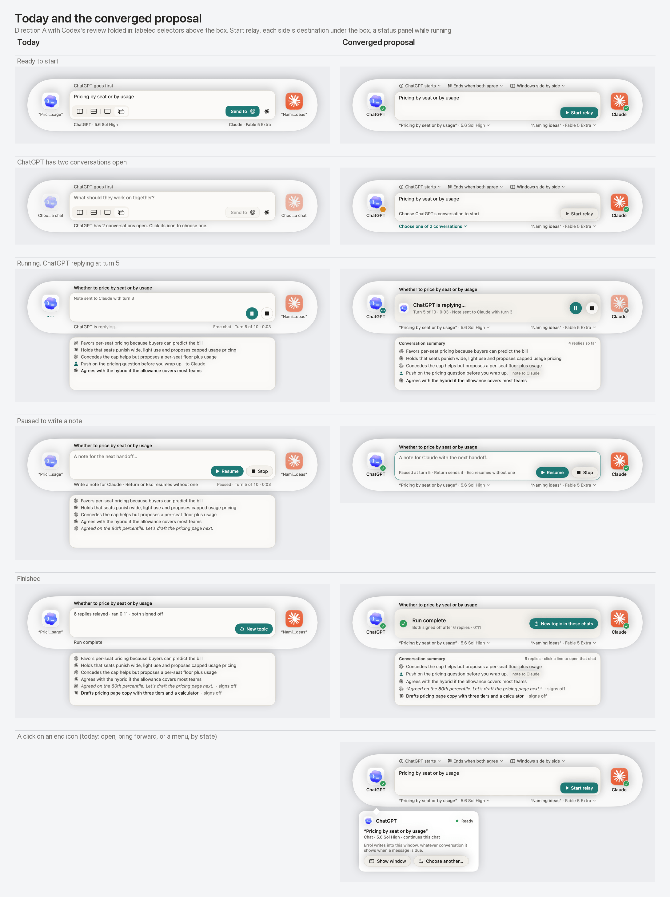

# Review of Claude's merged console proposal

Date: September 24, 2026. Status: accepted in the [final console-layout spec](../docs/design-proposals/console-layout/README.md).

The final spec and selected renders were checked against this review. The surface/title priority,
summary during pause, actual-hold action availability, and outcome-specific endings are incorporated.
Two wording corrections preserve accessible static status text and the existing Sending/Unconfirmed/Not
sent records for attempted steering notes. The refinements below remain as the record of that exchange.

Companions: [initial assessment, revised after seeing today's UI](ux-review-2026-09-24.md), [Claude's review](ux-review-2026-09-24-claude.md), and [the earlier interactive alternative](ux-review-2026-09-24-codex/earlier-layout.html).

## Decision

Accept Direction A with the merged changes as the base: keep the 860 × 156 capsule, app identities at opposite ends, the summary window beneath the central area, and stable action placement. Use persistent destination controls below the central box; labeled session choices above it; a real status panel while running; the note editor while paused; and a prominent outcome when finished.

This conclusion follows inspection of Claude's document, the rendered comparison sheet and participant popover, and relevant source code. It remains a heuristic judgment, not a result from usability testing.

## Where Claude improved my recommendation

1. **Destination names belong in the wider area beneath the box.** A second line within a 79-point end column would improve only short names. The two wider destination controls are a stronger use of the existing footprint. Keep the app names at the ends.
2. **Move window arrangement out of the composer.** A menu alongside the other session settings, showing the selected arrangement and containing Restore, is clearer than my suggestion to add a label beside the four icons.
3. **Differentiate a status panel from an editor.** Promoting the running headline and using a recessed surface work together. The distinction must also be semantic: no editable text element or text cursor while the relay owns that area. An accent outline alone is not the indication that the paused state is editable.
4. **Promote the finished outcome too.** The new headline/detail order is better. Apply it to the existing outcome-specific copy, not only successful completion.
5. **A small state symbol can complement the words.** Keep icons actionable and fully legible; readiness should not require interpreting faded artwork. Pair the badge with an accessible state name and corresponding text. Check, attention, waiting, and activity symbols should not depend on color alone.

## Refinements for the final spec

### Destination content: surface and title before model details

The existing console visibly distinguishes Claude Chat from Claude Code. In the proposed destination line, the title and model consume the available space and the surface is only in the popover. Preserve that distinction at a glance: for example, `Code · Pricing critique ▾` under Claude and `Chat · Pricing strategy ▾` under ChatGPT, using the actual detected surface names.

The priority within a side's approximately 290-point allocation should be surface, recognizable destination title, then optional model/effort. Move model/effort into the popover first when space is tight. Do not promise that a full title and model will always fit. Use a sensible title ellipsis and a popover with the complete title; test long and similar names. Show the current observed window content, and explicitly distinguish unverified/last-used information from a verified current destination.

This also preserves the honest window-binding explanation. Selecting or opening the participant popover must not itself change the destination or bring an app forward.

### Keep the summary when paused, and describe navigation honestly

The comparison sheet and `converged-4-paused.png` omit the summary window. The harness confirms this is how that particular static render was assembled (`harness/mocks.swift:842`). Preserve the summary and its scroll position through pause and resume: people are likely to consult the exchange while composing a note.

Change “click a line to open that chat” to an explicit “Show ChatGPT window” / “Show Claude window” action. Bringing a bound window forward does not navigate to the historical conversation or the exact reply, especially when the person has switched chats inside the window. Do not promise a deep link the implementation lacks. A keyboard-focusable row action can preserve compactness without depending solely on hover or invisible click behavior.

Quote fallback content as an excerpt when it is truncated. An original excerpt and a generated summary should remain distinguishable without suggesting that a one-line fallback contains the full reply.

### Define popover actions by the actual run state

One stable popover is the right interaction. Its information can remain available throughout the session, but its actions have distinct availability:

| Action | Composing / finished | Running or pause pending | Pause acknowledged |
| --- | --- | --- | --- |
| Inspect participant details | Available | Available, without bringing a target app forward | Available |
| Show window / summary-row navigation | Available | Unavailable; explain “Pause to show window” | Available while retaining the hold and note draft |
| Choose another destination | Available | Unavailable | Unavailable until the run ends |
| Change or restore arrangement | Available | Unavailable | Unavailable until the run ends |

The hold must be acknowledged by the relay before focus-changing actions become available. Clicking Pause is not itself proof that a handoff has stopped. Reuse the existing focus/hold coordination rather than adding a UI-only pause state. Inspecting a popover must not take focus needed by an in-progress copy/delivery operation; implement the popover's focus behavior under that same contract.

Evidence: `RelayController.beginSteering()` distinguishes an immediate hold from `.afterOperation`; `chooseAnotherConversation()` currently rejects all active runs, including paused runs (`RelayController.swift:626,713`).

### Retain outcome-specific completion and recovery

Use the new prominent headline with the existing `RunReport` outcome, including “Run stopped,” “Turn limit reached,” and delivery errors. A success checkmark and “Run complete” apply only to successful completion. An interrupted delivery must retain the existing instruction to check whether the message went through. A held run remains held, with recovery and Stop; it must not look like a finished run.

The final visual acceptance set should include one held state, pause pending, a queued note, a stopped/limited run, and an interrupted delivery, in addition to the six proposed images. The existing queued-note receipt is useful and should be retained in the new status panel.

Evidence: `Core/RunOutcome.swift` already separates these outcomes and supplies their headline and detail.

## Answers to the remaining questions

**Direct window shortcut:** do not add double-click in this revision. A single click opens the popover; a visible Show window action is sufficient. Double-click conflicts with that first click and introduces another hidden gesture after simplifying the icon's contract. Keep the existing explicit Open-app primary action when setup requires it.

**Settings:** add a small More button at a stable trailing position in the capsule's top row across all stages. Use an accessible “App menu” label and a tooltip; its menu includes Settings, run log, and relevant app-level actions. The menu-bar menu remains available. Keep run configuration in the visible pre-run selectors. Opening Settings during a run must obey the same focus ownership contract; it must not silently resume or stop the relay.

**Final document:** use `docs/design-proposals/console-layout/README.md`. Claude can write the final spec in the next round, link both assessments and this review, retain the image/harness links, and add an entry to the design-proposals index. This avoids competing final specs. Review and image files are currently uncommitted; application implementation is not part of this convergence step.

**Contrast validation:** accept the Classic Amber fixes and a focused test of actual normal-text foreground/background pairs in both appearances. Test semantic pairs actually used in the UI, including placeholder and button text, rather than every arbitrary pair in the palette. Rendered materials and focus/state indicators still need a visual check.

## Preserved assets

- [All of Claude's renders and harness](ux-review-2026-09-24-claude/).
- [Ready](ux-review-2026-09-24-claude/converged-1-ready.png), [destination choice](ux-review-2026-09-24-claude/converged-2-choose.png), [running](ux-review-2026-09-24-claude/converged-3-running.png), [paused](ux-review-2026-09-24-claude/converged-4-paused.png), [finished](ux-review-2026-09-24-claude/converged-5-finished.png), and [participant popover](ux-review-2026-09-24-claude/converged-6-participant.png). These remain the reviewed proposal version; the refinements above are not yet depicted.
- [Earlier Codex mockup as standalone HTML](ux-review-2026-09-24-codex/earlier-layout.html) and its [editable fragment](ux-review-2026-09-24-codex/earlier-layout.fragment.html). This is a historical alternative, not the selected direction.

Keep the next step bounded: incorporate these refinements into one final spec and the affected renders, then confirm convergence. No additional layout exploration is needed unless a refinement fails the actual size constraints.
